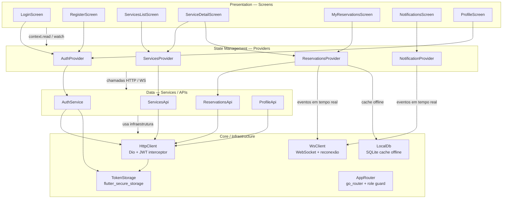
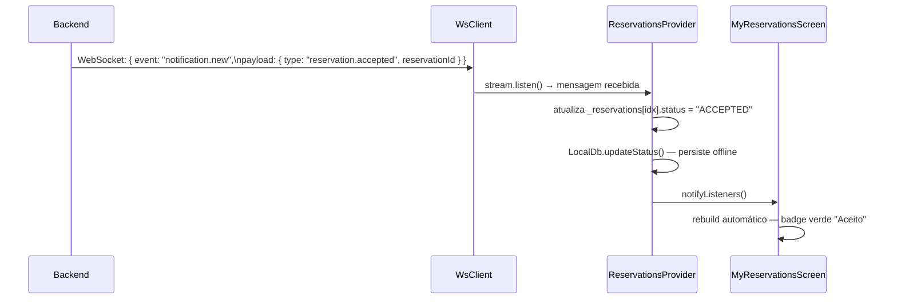

# Arquitetura do App Flutter — Clean Architecture

## Visão Geral

O app mobile segue os princípios de **Clean Architecture**, organizando o código em camadas com responsabilidades bem definidas e dependências que fluem de fora para dentro (da UI para o Core). Cada camada conhece apenas a camada imediatamente abaixo dela.

## Diagrama de Camadas

---

## Detalhamento por Camada

### 1. Presentation (Screens)

Responsável exclusivamente pela UI. Não acessa a API diretamente — delega toda lógica ao Provider correspondente via `context.watch` / `context.read`.

| Tela | Descrição |
|---|---|
| `LoginScreen` | Formulário de login, redireciona por role após autenticação |
| `RegisterScreen` | Cadastro de usuário com seleção de role (CLIENT/PROVIDER) |
| `ServicesListScreen` | Catálogo de serviços disponíveis com busca e pull-to-refresh |
| `ServiceDetailScreen` | Detalhe do serviço, picker de data/hora e botão "Confirmar Reserva" |
| `MyReservationsScreen` | Reservas do cliente com filtros de tempo/status e atualização em tempo real |
| `NotificationsScreen` | Inbox de notificações do usuário, marcação como lida |
| `ProfileScreen` | Edição inline de nome e email do perfil |

### 2. State Management (Providers)

Gerencia o estado da aplicação usando o pacote `provider` (ChangeNotifier). Faz a ponte entre UI e dados.

| Provider | Responsabilidade |
|---|---|
| `AuthProvider` | Estado global de autenticação (user, token, role), login/logout, conexão WS |
| `ServicesProvider` | Lista e filtro de serviços disponíveis |
| `ReservationsProvider` | Reservas do cliente, filtros, escuta eventos WebSocket para atualizar status em tempo real |
| `NotificationProvider` | Contagem de não lidas, escuta eventos WebSocket para novas notificações |

### 3. Data / Services (APIs)

Encapsula todas as chamadas HTTP e regras de acesso ao backend. Providers e Screens nunca fazem requisições diretamente.

| Service | Endpoints consumidos |
|---|---|
| `AuthService` | `POST /auth/login`, `POST /auth/register` |
| `ServicesApi` | `GET /services`, `GET /services/:id` |
| `ReservationsApi` | `POST /reservations`, `GET /reservations` |
| `ProfileApi` | `GET /users/me`, `PATCH /users/me` |

### 4. Core / Infrastructure

Componentes reutilizáveis e agnósticos de domínio. Nenhuma regra de negócio vive aqui.

| Componente | Tecnologia | Responsabilidade |
|---|---|---|
| `HttpClient` | Dio | Injeta JWT em toda requisição; interceptor 401 → logout automático |
| `WsClient` | web_socket_channel | Gerencia conexão WebSocket com reconexão automática (3s); stream de eventos |
| `LocalDb` | sqflite (SQLite) | Cache offline de reservas; atualização de status sem re-fetch |
| `TokenStorage` | flutter_secure_storage | Persiste token JWT no keychain do dispositivo |
| `AppRouter` | go_router | Roteamento declarativo com guards de role: não autenticado → `/login`; CLIENT → `/services`; PROVIDER → `/provider` (Sprint 4) |

---

## Fluxo de Atualização Assíncrona em Tempo Real

O diagrama abaixo ilustra como uma atualização de status de reserva chega ao app sem ação do usuário:

---

## Regras de Arquitetura

- **Screens** não importam classes de `services/` ou `core/network/` — apenas `providers/`
- **Providers** não importam widgets — apenas `services/` e `core/`
- **Services** não guardam estado — são stateless e recebem dependências via construtor
- **Core** é agnóstico de domínio — não conhece `ReservationModel`, `ServiceModel` etc.
