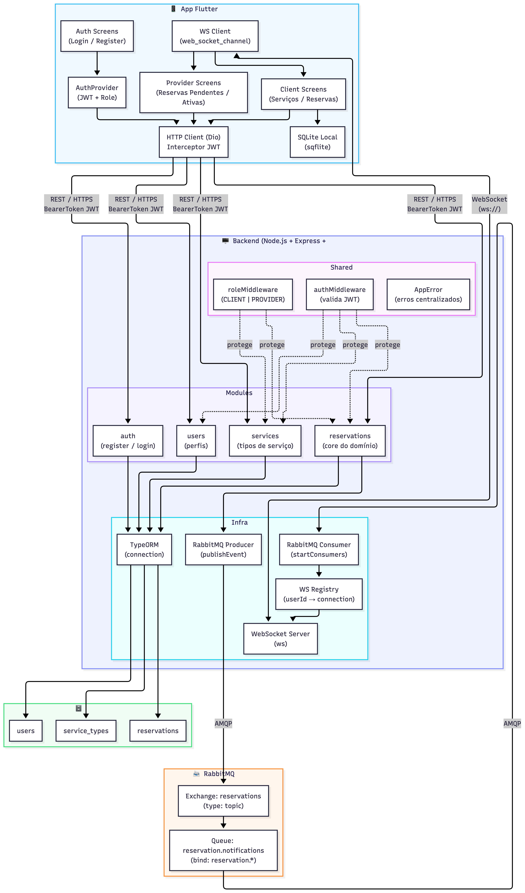
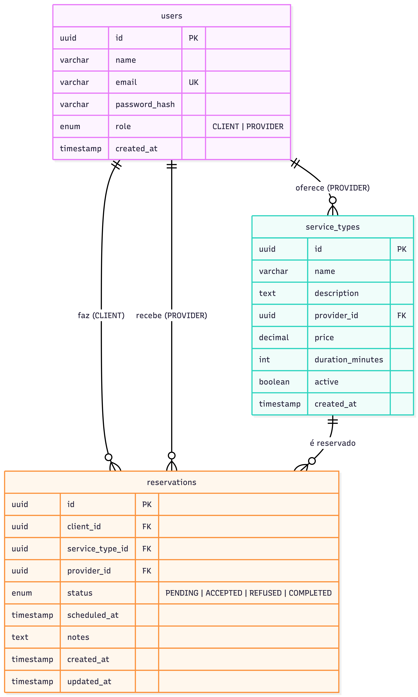

# Diagrama de Arquitetura — Sistema de Reserva de Serviços

## Introdução

Este documento descreve a arquitetura do sistema de reserva de serviços, desenvolvido como projeto da disciplina LAMD.

O sistema é composto por um **backend REST** em Node.js com Express e TypeScript, um **banco de dados relacional** PostgreSQL gerenciado via TypeORM, um **broker de mensagens** RabbitMQ para comunicação assíncrona entre componentes e um **app mobile** Flutter que consome a API e recebe notificações em tempo real via WebSocket.

A arquitetura segue princípios de **Clean Architecture** (separação em módulos com responsabilidade única) e **Event-Driven Architecture** (EDA), onde alterações de status de reservas disparam eventos publicados no RabbitMQ e consumidos de forma assíncrona, sem acoplamento direto entre produtores e consumidores.

---

## Visão Completa do Sistema

---

## Schema do Banco de Dados

---

## Componentes e Protocolos

| Componente | Tecnologia | Protocolo |
|---|---|---|
| App Mobile | Flutter + Provider + Dio | REST/HTTPS + WebSocket |
| Backend | Node.js + Express + TypeScript | HTTP |
| ORM | TypeORM | - |
| Banco de dados | PostgreSQL | TCP (porta 5432) |
| Mensageria | RabbitMQ | AMQP (porta 5672) |
| Notificações real-time | ws (Node.js) | WebSocket (porta 3001) |
| Autenticação | JWT (access token) | Bearer Token |
| Containerização | Docker + Docker Compose | - |
