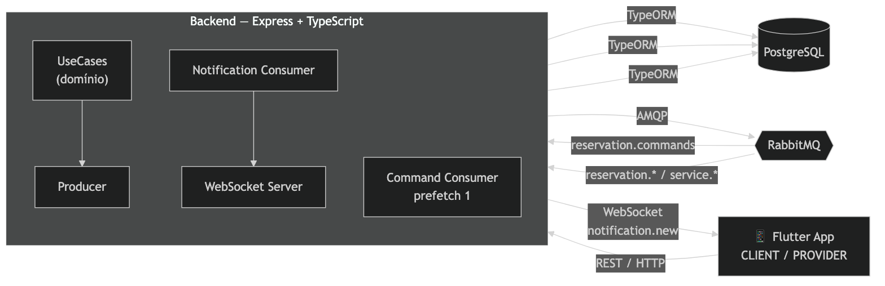

# Relatório Técnico Final — Sistema de Reserva de Serviços

### Laboratório de Desenvolvimento de Aplicações Móveis e Distribuídas (LDAMD)
### PUC Minas · 1º Semestre 2026

---

## 1. Introdução

Este relatório documenta o projeto desenvolvido ao longo das quatro sprints da disciplina: uma **plataforma de reserva de serviços** na qual dois perfis de usuário interagem em tempo real. O **cliente** (`CLIENT`) navega por um catálogo de serviços e cria reservas; o **prestador** (`PROVIDER`) cadastra os serviços que oferece e gerencia as reservas recebidas, aceitando, recusando ou concluindo cada uma.

O domínio foi escolhido por exercitar de forma natural os três pilares da ementa: uma **API REST** bem estruturada, **comunicação assíncrona via Message-Oriented Middleware (MOM)** e um **aplicativo móvel** que reflete mudanças de estado sem que o usuário precise atualizar a tela manualmente. O fluxo central — cliente reserva, prestador é notificado em tempo real, prestador responde, cliente é notificado de volta — só fica convincente quando a notificação é genuinamente assíncrona e empurrada para o dispositivo, o que motivou toda a arquitetura orientada a eventos descrita adiante.

O sistema é um **monorepo** com três grandes partes: `backend/` (Node.js + Express + TypeScript), `mobile/` (Flutter) e `docs/` (documentação, diagramas e coleção Postman). A infraestrutura de apoio (RabbitMQ) sobe via Docker Compose, e o PostgreSQL é fornecido por um serviço gerenciado, configurável por uma única variável de ambiente.

### Objetivos

- Implementar um backend REST modular, com autenticação JWT e controle de acesso por papel (role).
- Integrar um MOM (RabbitMQ) para desacoplar a criação de reservas e a entrega de notificações.
- Entregar um app Flutter funcional para os dois perfis, com atualização em tempo real via WebSocket.
- Garantir que o fluxo de ponta a ponta — da criação da reserva à conclusão — funcione de forma assíncrona e observável.

---

## 2. Arquitetura Implementada

A arquitetura combina três estilos: **REST** para as operações síncronas de leitura/escrita, **Event-Driven Architecture (EDA)** para as reações a mudanças de estado, e **Clean Architecture** como organização interna de cada componente.



> Diagramas detalhados: [`docs/images/DiagramaArquitetura.png`](images/DiagramaArquitetura.png) (visão completa) e [`docs/images/DiagramaDER.png`](images/DiagramaDER.png) (modelo de dados). A arquitetura interna do app está em [`docs/arquitetura-flutter.md`](arquitetura-flutter.md).

### 2.1 Backend

Organizado em **módulos por domínio** (`auth`, `users`, `services`, `reservations`, `notifications`), cada um seguindo a cadeia **Controller → UseCase → Repository**:

- **Controller** — recebe a requisição, valida o corpo com **Zod** e delega ao UseCase. Não contém regra de negócio.
- **UseCase** — concentra a lógica de domínio e depende de **interfaces** de repositório (`IReservationRepository`, `IUserRepository`...), nunca da implementação concreta.
- **Repository** — encapsula o TypeORM, isolando o restante do código de detalhes de persistência.

A camada `infra/` contém os adaptadores externos: `database/` (DataSource e migrations do TypeORM), `messaging/` (RabbitMQ) e `websocket/` (servidor `ws`). A camada `shared/` reúne o `container/` de injeção de dependência (factories que montam os UseCases com seus repositórios), os middlewares (`authMiddleware`, `roleMiddleware`), os enums (`Role`, `ReservationStatus`) e a classe `AppError` para tratamento de erros centralizado.

### 2.2 Banco de Dados

PostgreSQL acessado via TypeORM com **migrations versionadas** (nada de `synchronize`). As entidades principais:

| Tabela | Papel |
|---|---|
| `users` | Usuários com `role` (`CLIENT` \| `PROVIDER`) e `password_hash` (bcrypt) |
| `service_types` | Serviços oferecidos por um prestador (preço, duração, `active`) |
| `reservations` | Core do domínio: `status`, `scheduled_at`, vínculos cliente/serviço/prestador |
| `notifications` | Inbox persistente (`type`, `payload` JSONB, `read`) |

Migrations posteriores adicionaram o status `CANCELLED`, a tabela de notificações, regras de **cascade delete** para preservar integridade referencial ao remover serviços/usuários, e duas colunas JSONB: `required_fields` em `service_types` (lista de perguntas que o prestador exige do cliente antes da reserva) e `client_answers` em `reservations` (mapa pergunta → resposta submetido pelo cliente ao criar a reserva). O uso de JSONB evitou tabelas de junção adicionais para um campo de estrutura variável, mantendo a migração aditiva e o schema principal enxuto.

### 2.3 Mensageria

Dois consumers dedicados, cada um com responsabilidade única:

- `ReservationCommandConsumer` — consome a fila `reservation.commands` com `prefetch(1)`.
- `NotificationConsumer` — consome a fila `notification.persist` (bindings `reservation.*` e `service.*`), persiste a notificação e dispara o WebSocket.

### 2.4 App Flutter

Estrutura em `core/` (infraestrutura: `http_client` com Dio, `ws_client`, auth, router) e `features/` (`auth`, `client`, `provider`). O estado é gerenciado com **Provider** (`ChangeNotifier`), e a navegação com **go_router**, que aplica o *guard* de papel: um `CLIENT` é redirecionado para `/client/*` e bloqueado de `/provider/*`, e vice-versa. Cada `feature` segue **Screens → Providers → Services**, mantendo as telas alheias ao HTTP/WS.

### 2.5 Notificações em Tempo Real

O `WsClient` do app abre uma conexão `ws://host:3000?token=<jwt>` após o login. No backend, o servidor WebSocket roda **no mesmo processo e porta do HTTP**, valida o JWT e registra a conexão por `userId` em um *registry*. Quando o `NotificationConsumer` processa um evento, consulta o registry: se o destinatário está online, empurra `{ event: "notification.new", payload }`; se não, a notificação permanece no banco para ser lida depois via `GET /notifications`.

---

## 3. Decisões de Design

| Decisão | Escolha | Justificativa |
|---|---|---|
| Estilo de organização | Clean Architecture por módulos | Separação por domínio (SRP) e dependência sobre interfaces (DIP) facilitam teste e evolução |
| MOM | RabbitMQ | Maduro, com exchanges/filas, Management UI para observação e suporte nativo aos padrões EIP necessários |
| Tipo de exchange | `topic` | Roteamento por padrão (`reservation.*`, `service.*`) permite adicionar eventos sem reconfigurar consumers (OCP) |
| Criação de reserva | Command Message + `prefetch(1)` | Serializa a criação e resolve a condição de corrida de dois clientes no mesmo horário |
| Entrega de notificação | WebSocket + inbox persistente | Tempo real para quem está online; nada se perde para quem está offline |
| State management mobile | Provider | Simples e suficiente para o escopo, sem o boilerplate de soluções maiores |
| HTTP client | Dio | Interceptors injetam o JWT automaticamente e tratam o 401 com logout |
| Navegação/guards | go_router | Redirecionamento declarativo por papel reutiliza o mesmo `AuthProvider` em ambos os perfis |
| Banco PostgreSQL gerenciado | `DATABASE_URL` única + SSL automático | Mesma config serve para banco local e em nuvem; SSL liga sozinho fora de `localhost` |
| Perguntas obrigatórias por serviço | JSONB em `required_fields` / `client_answers` | Dados de estrutura variável sem tabela de junção; validação centralizada no `CreateReservationUseCase` antes de enfileirar o comando |

A decisão arquitetural mais importante foi **tratar a criação de reserva como um comando assíncrono**, e não como um simples `INSERT` síncrono. Isso afasta o controle de concorrência da borda HTTP e o concentra em um único ponto serializado, ao custo de o cliente receber `202 Accepted` e ser informado do resultado por evento — uma troca alinhada à natureza orientada a eventos do sistema.

---

## 4. Fluxo de Eventos

**Exchange:** `reservations` (`topic`, durable). **Filas:** `reservation.commands` (comandos) e `notification.persist` (eventos de notificação).

| Evento (routing key) | Produtor | Destino | Conteúdo essencial |
|---|---|---|---|
| `reservation.commands` | `CreateReservationUseCase` | (comando interno) | `clientId`, `serviceTypeId`, `scheduledAt`, `notes`, `clientAnswers` |
| `reservation.created` | `ReservationCommandConsumer` | Prestador | `reservationId`, `clientName`, `serviceType`, `scheduledAt` |
| `reservation.conflict` | `ReservationCommandConsumer` | Cliente | `reason`, `serviceType`, `scheduledAt` |
| `reservation.accepted` | `UpdateReservationStatusUseCase` | Cliente | `reservationId`, `providerName`, `scheduledAt` |
| `reservation.refused` | `UpdateReservationStatusUseCase` | Cliente | `reservationId`, `providerName`, `scheduledAt` |
| `reservation.completed` | `UpdateReservationStatusUseCase` | Cliente | `reservationId`, `providerName`, `completedAt` |
| `reservation.cancelled` | `CancelReservationUseCase` (cliente) | Prestador | `reservationId`, `clientName`, `serviceType` |
| `reservation.cancelled_by_provider` | `CancelReservationUseCase` (prestador) | Cliente | `reservationId`, `providerName`, `serviceType` |
| `service.deactivated` | `UpdateServiceUseCase` | Clientes afetados (fan-out) | `serviceId`, `serviceType`, `reservationId` |
| `service.updated` | `UpdateServiceUseCase` | Clientes afetados (fan-out) | `serviceId`, `serviceType`, `reservationId` |

> Payloads completos e exemplos de cada evento em [`docs/events.md`](events.md).

### Fluxo de ponta a ponta (caminho feliz)

```
1.  CLIENT faz login (JWT) e abre conexão WebSocket
2.  CLIENT cria reserva → POST /reservations
3.  Backend publica em reservation.commands → responde 202 Accepted
4.  ReservationCommandConsumer (prefetch 1) verifica conflito e persiste no PostgreSQL
5.  Consumer publica reservation.created (destino: prestador)
6.  NotificationConsumer persiste a notificação e empurra via WS
7.  PROVIDER vê a reserva surgir na PendingReservationsScreen em tempo real (badge "Nova")
8.  PROVIDER aceita → PATCH /reservations/:id/status (ACCEPTED)
9.  UpdateReservationStatusUseCase publica reservation.accepted (destino: cliente)
10. CLIENT vê o status mudar para ACCEPTED na MyReservationsScreen, sem refresh
11. PROVIDER conclui → status COMPLETED → CLIENT recebe a atualização final
```

---

## 5. Dificuldades e Soluções

**Condição de corrida na criação de reservas.** O cenário-problema: dois clientes tentam reservar o mesmo serviço no mesmo horário simultaneamente. Uma verificação síncrona "consulta depois insere" sofre de *time-of-check to time-of-use*. A solução combinou duas medidas: rotear toda criação por uma fila de comandos consumida com `prefetch(1)` (apenas uma mensagem processada por vez, serializando as criações) e fazer a verificação de conflito imediatamente antes do `INSERT`, já dentro do consumer. O `prefetch` garante a ordem; a verificação garante a integridade.

**Identidade da conexão WebSocket.** Como saber para qual socket enviar uma notificação? A conexão carrega o JWT no query param; o servidor o valida no handshake e registra a conexão em um mapa `userId → socket`. O consumer, ao processar um evento, usa o `targetUserId` do payload para localizar o socket. Conexões que caem são removidas do registry, e o app reconecta automaticamente após o login.

**Usuários offline não podem perder eventos.** Empurrar só por WebSocket deixaria quem está offline sem saber do que aconteceu. A solução foi separar persistência de entrega: o `NotificationConsumer` **sempre** grava na tabela `notifications` e **só então** tenta o WebSocket. O app recupera o histórico por `GET /notifications` (com `unreadCount`) e o WebSocket vira um canal de baixa latência, não a única fonte de verdade.

**Reuso entre os dois perfis no app.** Cliente e prestador compartilham login, navegação, conexão WS e tela de perfil, mas têm fluxos distintos. Em vez de dois apps, manteve-se um único app com `RoleGuard`/redirect no go_router e um `AppShell` que troca abas, ícones e rotas conforme o `role` — o que tornou a Sprint 4 essencialmente aditiva sobre a base da Sprint 3.

**Interação entre solicitação e confirmação de serviço.** A avaliação da Sprint 3 levantou a necessidade de o prestador poder exigir informações do cliente antes de aceitar uma reserva (ex.: número de pets, raça). A solução adicionou `required_fields` (JSONB) ao serviço e `client_answers` (JSONB) à reserva, com validação no `CreateReservationUseCase`: se o serviço possui perguntas obrigatórias e o payload não traz respostas para todas elas, o use case lança `AppError 400` antes mesmo de publicar o comando na fila — evitando que reservas incompletas cheguem ao consumer. No app, o cliente visualiza os campos obrigatórios na tela de detalhe do serviço e o botão "Confirmar Reserva" permanece desabilitado enquanto houver respostas em branco; o prestador vê as respostas na tela de detalhe da reserva.

**Integridade ao remover entidades.** Apagar um serviço ou usuário com reservas associadas quebrava referências. Migrations dedicadas adicionaram regras de *cascade delete*, e a desativação de serviço passou a cancelar (`CANCELLED`) e notificar as reservas afetadas, em vez de deixar registros órfãos.

---

## 6. Reflexão sobre Padrões

**Event-Driven Architecture (EDA).** O projeto evidencia o ganho central da EDA: produtores e consumidores não se conhecem. O `UpdateReservationStatusUseCase` apenas publica `reservation.accepted` — ele ignora se existe WebSocket, persistência ou e-mail por trás. Adicionar um novo canal de entrega (push, e-mail) seria criar outro consumidor no mesmo evento, sem tocar no produtor. É o princípio Open/Closed aplicado na fronteira entre componentes, descrito por Richardson (2018) como a base da comunicação assíncrona em sistemas distribuídos.

**MOM e Enterprise Integration Patterns.** Os dois padrões de Hohpe & Woolf (2003) usados aqui têm papéis nítidos. O **Command Message** carrega uma intenção a ser executada por um único consumidor responsável (criar a reserva), o que justifica a fila dedicada e o `prefetch(1)`. O **Event Notification** ("isto aconteceu") admite múltiplos interessados e casa com o `topic exchange`, cujo roteamento por padrão deixa a lista de consumidores aberta. A escolha consciente entre comando e evento foi o que estruturou a malha de mensagens.

**Clean Architecture.** A regra de dependência de Martin (2019) — código de fora depende de código de dentro, nunca o contrário — aparece nos UseCases dependendo de interfaces de repositório, com o TypeORM confinado às implementações concretas. No app, a mesma ideia se traduz em telas que não tocam HTTP, falando apenas com Providers, que por sua vez delegam a Services. O resultado prático é que trocar o ORM ou o cliente HTTP teria impacto local.

**REST como complemento, não concorrente.** REST e EDA não competem: o sistema usa REST para o que é síncrono por natureza (login, listagens, leitura de detalhe) e eventos para o que é reativo (notificações, mudanças de estado propagadas). Reconhecer que cada estilo resolve um problema diferente — e combiná-los — foi uma das lições mais concretas do projeto.

---

## 7. Referências

1. MARTIN, Robert C. **Arquitetura Limpa: o guia do artesão para estrutura e design de software**. Rio de Janeiro: Alta Books, 2019.
2. HOHPE, Gregor; WOOLF, Bobby. **Enterprise Integration Patterns: Designing, Building, and Deploying Messaging Solutions**. Boston: Addison-Wesley, 2003.
3. RICHARDSON, Chris. **Microservices Patterns: With Examples in Java**. Shelter Island: Manning, 2018.
4. COULOURIS, George et al. **Distributed Systems: Concepts and Design**. 5th ed. Boston: Addison-Wesley, 2011.
5. BAILEY, Thomas. **Flutter for Beginners**. 3rd ed. Birmingham: Packt Publishing, 2023.

---

### Anexos e documentação complementar

- [`docs/api.md`](api.md) — documentação completa dos endpoints REST
- [`docs/events.md`](events.md) — catálogo de eventos e payloads do RabbitMQ
- [`docs/arquitetura.md`](arquitetura.md) — diagramas de arquitetura e DER
- [`docs/arquitetura-flutter.md`](arquitetura-flutter.md) — camadas internas do app
- [`docs/relatorio-integracao.md`](relatorio-integracao.md) — relatório de integração do MOM (Sprint 2)
- [`docs/postman-collection.json`](postman-collection.json) — coleção Postman para testar a API
